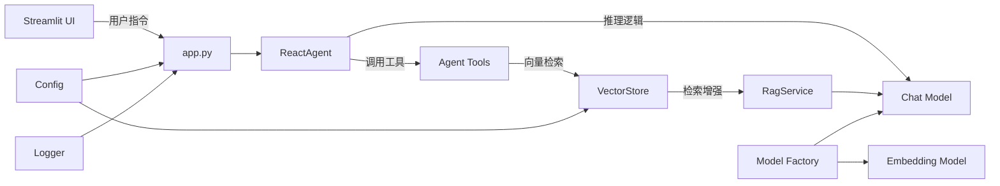

# 🤖 智扫通 Agent 项目概览

本项目是一个面向消费者（toC）的**扫地机器人智能客服系统**。它不仅在购前、使用中及售后阶段提供全场景问答支持，还能基于 RAG 技术提供精准的决策依据。


---

### 一、核心功能

- **智能问答服务**
  - **全周期支持**：处理购前咨询（型号对比、护户型适配）、使用指引及售后故障排查。
  - **RAG 增强生成**：基于扫地机专业知识库，结合大模型生成高置信度的本地化回复。
- **ReAct 智能决策**
  - 采用 **思考-行动-观察** 框架，能够根据用户意图精准调用 RAG 工具或进行数据分析。
- **现代化 UI 交互**
  - 提供基于 **Streamlit** 的深美化前端界面，支持多回话管理、流式输出及历史记录持久化。


---

### 二、代码目录架构

本项目已完成核心工程搭建，各模块职司如下：

```text
zhisaotong_agent/
  ├─ agent/                     # 智能体核心逻辑
  │  ├─ tools/                  # 智能体可调用工具（RAG、数据分析等）
  │  └─ react_agent.py          # ReAct 对话流控制中心
  ├─ config/                    # 业务配置文件 (YAML)
  ├─ model/                     # 模型连接工厂 (Chat / Embedding)
  ├─ prompts/                   # 提示词模板与 System Prompt 仓库
  ├─ rag/                       # RAG 检索增强引擎
  │  ├─ rag_service.py          # 文档检索与摘要服务
  │  └─ vector_store.py         # 向量库 (Chroma) 封装
  ├─ utils/                     # 增强工具集（配置读写、文件处理、日志等）
  ├─ app.py                     # Streamlit 应用主入口
  └─ PROJECT_OVERVIEW.md        # 项目技术白皮书
```

---

### 三、技术架构 (Mermaid)



---

### 四、开发计划与状态

- [x] **第一阶段**：基础工程搭建、依赖与环境配置。
- [x] **第二阶段**：向量库构建、知识文档导入与 RAG 检索闭环。
- [x] **第三阶段**：ReAct 智能体逻辑实现、工具函数注入。
- [x] **第四阶段**：UI 美化、多轮对话持久化与流式响应优化。
- [ ] **持续迭代**：接入更多维度的用户使用报告分析、耗材提醒等高级功能。

---

> [!TIP]
> 运行方式：执行 `streamlit run zhisaotong_agent/app.py` 即可开启专业服务。

